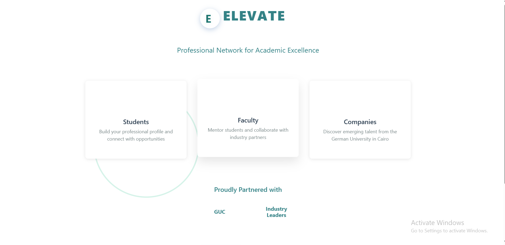
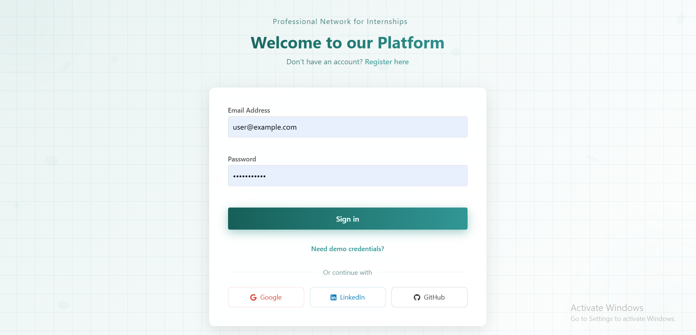
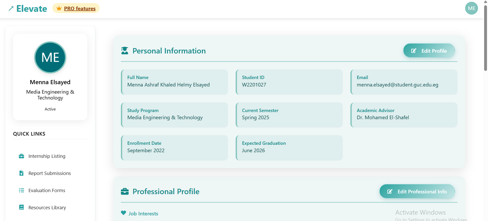
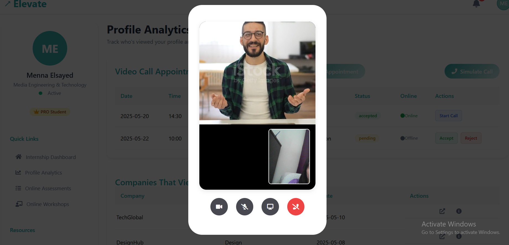
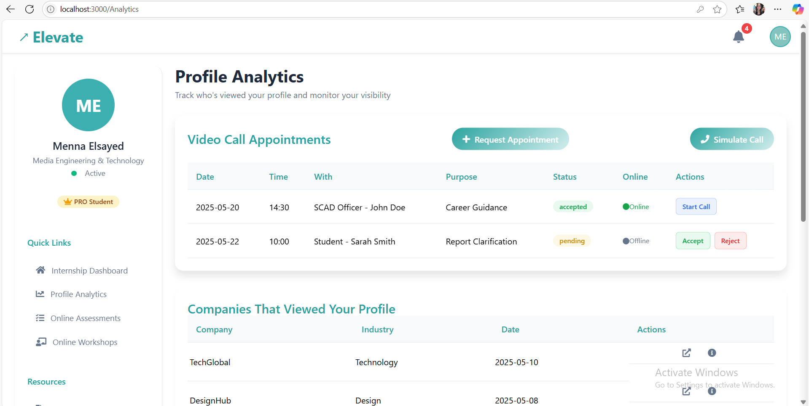

# GUC Internship System - Nexis

## Overview
The GUC Internship System (Nexis) is a front-end web application developed as part of the Software Engineering course (Spring 2025) at the German University in Cairo. This project, built for Milestone 2, focuses on designing and implementing a prototype for managing internship applications, enrollments, assessments, and evaluations. The system is developed using **React.js** and **CSS**, adhering to UI/UX principles outlined in the course and guided by the assigned Product Manager.

The application serves multiple user roles:
- **Companies**: Register, post internships, review applications, and evaluate interns.
- **Students/PRO Students**: Apply for internships, submit reports, and manage profiles.
- **SCAD Office/Faculty Members**: Manage company applications, review reports, and monitor statistics.

This repository contains the front-end code, utilizing dummy data to simulate functionalities without a backend or database.

## Project Details
- **Team**: CSEN603-2025
- **Repository**: [https://github.com/CSEN603-2025/Nexis](https://github.com/CSEN603-2025/Nexis)
- **Technologies Used**:
  - **React.js**: For building dynamic and interactive UI components.
  - **CSS**: For styling and ensuring a coherent, professional design.
- **Duration**: March 2025 - May 2025
- **Objective**: Create a user-friendly, intuitive prototype that meets the functional requirements specified in the "MS2 Requirements.xlsx" file and adheres to UI/UX guidelines.

## Features
The system fulfills 94 functional requirements, including but not limited to:
- Company registration and document upload.
- Internship posting, application management, and intern evaluation.
- Student profile management, internship applications, and report submissions.
- SCAD Office functionalities like company approval, report review, and real-time statistics.
- PRO Student features such as online assessments, workshop registration, and video call appointments.
- Responsive UI with reversible navigation, error handling, and consistent design.

For a complete list of requirements, refer to the [MS2 Requirements.xlsx](User-Requirements.xlsx)

## Installation and Setup
To run the project locally:

1. **Clone the repository**:
   ```bash
   git clone https://github.com/CSEN603-2025/Nexis.git
   cd Nexis
   ```

2. **Install dependencies**:
   ```bash
   npm install
   ```

3. **Run the development server**:
   ```bash
   npm start
   ```

4. Open [http://localhost:3000](http://localhost:3000) in your browser to view the application.

## UI/UX Guidelines
The system follows UI/UX principles emphasized in the course:
- **Learnability**: Intuitive navigation and clear user journeys.
- **Efficiency**: Minimal clicks to perform tasks.
- **Feedback**: Visual cues and notifications for user actions.
- **Error Handling**: Prevents errors and provides clear error messages.
- **Consistency**: Unified color palette, typography, and UI elements.
- **Professionalism**: Clean, symmetric design with a modern aesthetic.

The UI/UX evaluation is subjective and based on the Product Manager's feedback, as outlined in the project description.

## Screenshots
Below are some screenshots showcasing the web application's interface:
## Home Page
  
## Login Page
  
## Student Page
 
## PhoneCall Interface
  
## Calls Page
  


## Acknowledgments
- **Instructors**: Assoc. Prof. Mervat Abuelkheir, Dr. Aya Mohamed.
- **Teaching Assistants**: Eng. Nada Ibrahim, Eng. Yasmine Elbehairy, Eng. Hager Khaled, Eng. Mariam Tamer, Eng. Heba Hegazy, Eng. Farida Helmy.
- **Product Manager**: For providing guidance on front-end design and UI/UX expectations.

## Contact
For questions or clarifications, contact the team through the assigned Product Manager or refer to the course CMS for additional resources.
